# ПРОТОТИП LAB — prototiplab.ru, редизайн 2026

Сайт студии 3D-моделирования, сканирования и производства в Москве. Статический сайт на Astro с живым
three.js-объектом, сценой процесса по прокрутке, сравнением FDM/SLA и пошаговым брифом «Рассчитать проект».

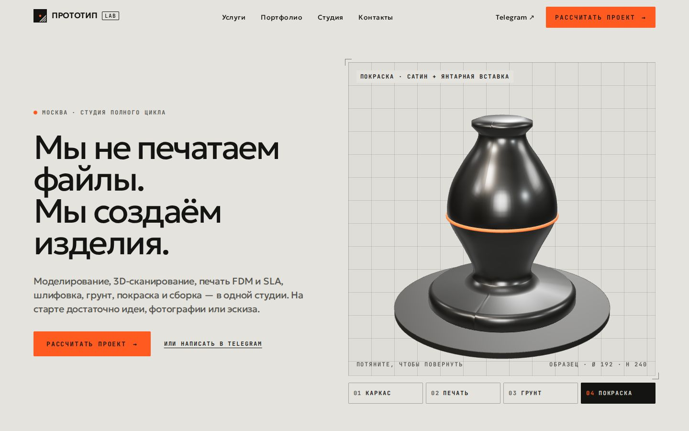

## Запуск

```bash
npm start            # одна команда: ставит зависимости и поднимает dev-сервер на http://127.0.0.1:4321
```

Продакшн-сборка:

```bash
npm install
npm run build        # → dist/ (17 статических страниц, sitemap, robots, редиректы старых адресов)
npm run preview      # проверить сборку на http://127.0.0.1:4321
```

`dist/` — обычная статика: её можно положить в любой веб-сервер. Node нужен только для сборки (≥ 22).

### Интеграции (переменные сборки, см. `.env.example`)

| Переменная | Что делает | По умолчанию |
|---|---|---|
| `PUBLIC_QUOTE_ENDPOINT` | URL, куда форма «Рассчитать проект» отправляет заявку (`POST`, `multipart/form-data`) | пусто — **форма ничего никуда не отправляет**: собирает бриф, копирует его и предлагает Telegram |
| `PUBLIC_YM_ID` | номер счётчика Яндекс Метрики; скрипт вставляется в `<head>` только если задан | пусто — Метрики нет |

Поля заявки: `task`, `size_cm`, `size_unknown`, `quantity`, `deadline`, `deadline_date`, `description`, `files[]`
(до 10 файлов по 25 МБ), `name`, `contact`, `consent` (=1, согласие по 152-ФЗ), `brief` (текст брифа целиком),
`page`, `company_site` (ловушка для ботов — если заполнено, заявку надо отбросить). Обработчик должен вернуть 2xx;
иначе посетитель видит состояние ошибки с тем же брифом, скопированным для Telegram. Цель Метрики: `quote_sent`.

Контакты, которые ждут подтверждения (почта, WhatsApp, адрес), заполняются в `src/data/site.ts` — после этого
появляются в подвале, на «Контактах» и в разметке LocalBusiness.

### Выкладка на nginx

Старые адреса (`/services.html`, `/case-helmet.html`…) в сборке уже переадресуются мета-редиректом и перечислены
в `dist/_redirects`. Для настоящих 301 на nginx:

```nginx
location = /services.html   { return 301 /uslugi/; }
location = /modeling.html   { return 301 /uslugi/modelirovanie/; }
location = /scanning.html   { return 301 /uslugi/skanirovanie/; }
location = /figurines.html  { return 301 /uslugi/figurki/; }
location = /merch.html      { return 301 /uslugi/merch/; }
location = /cosplay.html    { return 301 /uslugi/kosplej/; }
location = /portfolio.html  { return 301 /portfolio/; }
location = /case-award.html { return 301 /portfolio/nagrady-it-konferencii/; }
location = /case-helmet.html { return 301 /portfolio/shlem-po-skanu/; }
location = /case-part.html  { return 301 /portfolio/detal-snyataya-s-proizvodstva/; }
location = /about.html      { return 301 /studiya/; }
location = /contact.html    { return 301 /kontakty/; }
location = /index.html      { return 301 /; }
error_page 404 /404.html;
location /_astro/ { expires 1y; add_header Cache-Control "public, immutable"; }
```

Прежний сайт целиком лежит в `legacy/` (и в истории git) — откат = выложить `legacy/`.

## Страницы

| Маршрут | Было |
|---|---|
| `/` | `index.html` |
| `/uslugi/` и `/uslugi/{modelirovanie, skanirovanie, figurki, merch, kosplej, prototipirovanie}/` | `services.html`, `modeling.html`, `scanning.html`, `figurines.html`, `merch.html`, `cosplay.html`; прототипирование было якорем — теперь страница, собранная только из текстов старого сайта |
| `/portfolio/` + 3 кейса | `portfolio.html`, `case-*.html` |
| `/studiya/` | `about.html` |
| `/kontakty/` | `contact.html` |
| `/raschet/` | форма с `contact.html`, теперь шестишаговый бриф |
| `/politika-konfidencialnosti/` | не было |
| `/404.html` | `404.html` |

## Направление бренда — «Грунт и графит»

Мастерская, где цифра становится вещью. Палитра — буквально материалы процесса: светлый грунт `#E4E3DE` (фон),
графит `#141413` (текст и тёмные главы), янтарь `#FF5A1F` (свет УФ-фильтра SLA-принтера — единственный акцент,
только заливкой). Интерфейс — как разметка на верстаке: моноширинные метки-техкарты, квадратные углы, никаких
градиентов, теней и стекла. Главный визуальный материал — объект «Образец», нарисованный кодом и проходящий на
глазах каркас → печать → грунт → покраску. Подробно: [`clone-workspace/prototiplab/brand.md`](clone-workspace/prototiplab/brand.md).

### Шрифты

| Роль | Шрифт | Почему |
|---|---|---|
| Заголовки и текст | **Geologica** Variable (OFL) | крупный x-height держит длинные русские слова на крупном кегле при весе 400 и трекинге −0,05 em; широкая апертура читается в 16–18 px |
| Метки, цифры, кнопки | **JetBrains Mono** Variable (OFL) | моноширинные цифры техкарты; кириллица не слипается в 11–13 px капсом с разрядкой |

Оба собираются в бандл из npm (`@fontsource-variable/*`) и отдаются с того же домена — внешних CDN на сайте нет.

## Референс Awwwards

Награды проверены на awwwards.com 26.09.2026. Оценки 1–5.

| Сайт | Награда | Объекты | Структура | Крафт | Бренд | Мобайл/a11y | Итого |
|---|---|---|---|---|---|---|---|
| **[Terminal Industries](https://terminal-industries.com)** | **Site of the Month, сентябрь 2025**; SOTD; Developer Award | 4 | 5 | 5 | 5 | 4 | **23** |
| [Floema](https://www.floema.com/en) | Site of the Month, май 2026 | 4 | 4 | 5 | 3 | 3 | 19 |
| [Igloo Inc](https://www.igloo.inc) | Site of the Year 2024; Site of the Month | 5 | 1 | 5 | 3 | 1 | 15 |
| [Lando Norris](https://landonorris.com) | Site of the Year 2025; Site of the Month | 3 | 2 | 5 | 2 | 2 | 14 |
| [Montfort](https://mont-fort.com) | Site of the Month, июнь 2025 | 1 | 3 | 4 | 1 | 2 | 11 |
| [Opal Tadpole](https://www.opalcamera.com/opal-tadpole) | Site of the Year 2024 | — | — | — | — | — | снят: награждённая страница больше не отдаётся |

**Основной — Terminal Industries.** Единственный кандидат, чья *структура* уже держит студию услуг с конверсией
через калькулятор: главы «проблема → система → результат», одна мысль на экран, живой расчёт рядом с формой,
чередование светлых и почти чёрных глав, один сигнальный цвет. Взята система: 12 колонок, поля 4,86 vw, шкала
заголовков с весом 400 и трекингом −0,05 em, моно-метки капсом с разрядкой, expo-out 1 с для появления, sine-out
0,3 с для наведения, вырез угла при смене главы, панель-итог рядом с формой.
**Дополнительный — Igloo Inc**, одно качество: объект меняет состояние материала по прокрутке.
Ни одного файла, шрифта, изображения или строки кода с этих сайтов не взято. Разбор: [`reference.md`](clone-workspace/prototiplab/reference.md).

## Происхождение токенов

Каждый токен в [`DESIGN.md`](clone-workspace/prototiplab/03-design-spec/DESIGN.md) помечен: `brand` (решения
Stage 1), `reference` (измерено у Terminal Industries), `derived` (вычислено, с пометкой как).

| Группа | Источник | Примеры |
|---|---|---|
| Цвета | brand | грунт, графит, янтарь, приглушённые тексты (проверены на контраст WCAG) |
| Шрифты | brand | Geologica, JetBrains Mono |
| Изображения | brand | объект кодом, перекрашенные фото студии |
| Сетка, поля, шаг колонок | reference | 12 кол., 70 px @1440 / 20 px @390, 15 px |
| Шкала шрифта, межбуквенные | reference | 70/48/34,5/27/20 px, −0,05 em у H1 |
| Ритм секций | reference | 120 px @1440 |
| Движение | reference | `cubic-bezier(0.19,1,0.22,1)` 1 с, `cubic-bezier(0.39,0.575,0.565,1)` 0,3 с |
| Радиусы | reference + brand | 0 на поверхностях (reference), 2 px на контролах (brand — строже, чем 8 px у референса) |
| Линии, ошибки, 4-px шаг, стаггер | derived | графит 14 %, `#B3261E`, 0,08 с |

## Интерактивный слой

- **«Образец» в первом экране** — three.js, процедурная геометрия (LatheGeometry по профилю), четыре состояния
  материала с кнопками и счётчиком слоёв; вращение мышью, касанием и стрелками. На слабых устройствах, при
  `prefers-reduced-motion`, Save-Data и программном WebGL — статичный SVG того же силуэта, three.js не загружается.
- **Процесс по прокрутке** — один объект проходит Идея → Модель → Печать → Постобработка → Готовое изделие.
  На телефоне — список с кадром на каждый этап.
- **FDM vs SLA** — разрез одной поверхности со слоем 0,2 и 0,05 мм, разделитель (мышь, касание, клавиатура), лупа ×3, таблица.
- **Портфолио** — фильтр по категориям с FLIP-анимацией и `?cat=` в адресе; страницы кейсов с оглавлением.
- **Бриф** — 6 шагов, живая панель «Ваш бриф», загрузка файлов, валидация на месте, согласие по 152-ФЗ со ссылкой
  на политику, состояния «отправляем / отправлено / ошибка / отправка не подключена», Telegram на каждом шаге.
- Переходы между страницами — нативные View Transitions; плавная прокрутка Lenis только для мыши.

Для проверки 3D в headless-браузере: `/?3d=1`.

## Изображения

Порядок: фото студии → код → генерация. Сгенерировано **0** изображений, расход OpenRouter **$0.00 из $0.70**
([`image-plan.md`](clone-workspace/prototiplab/image-plan.md), [`image-ledger.md`](clone-workspace/prototiplab/image-ledger.md)).
Все 20 изображений старого сайта — сгенерированные рендеры, не фото работ; они перекрашены из фиолетового в
палитру бренда (`npm run photos`) и подписаны как иллюстрации. Манифест: [`assets/SOURCES.md`](assets/SOURCES.md).

## До / после

| До | После |
|---|---|
| 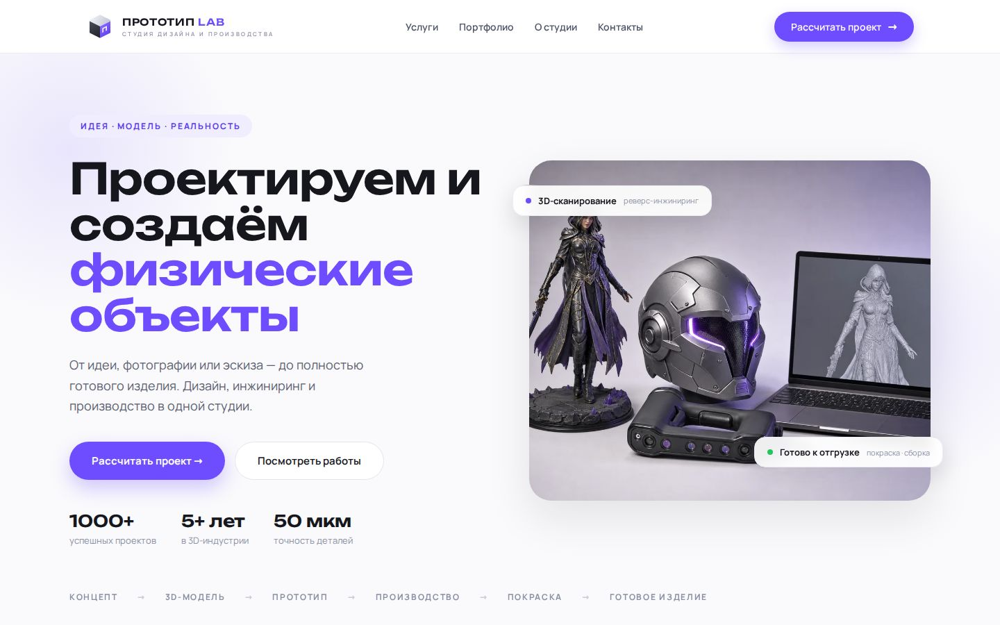 |  |
| 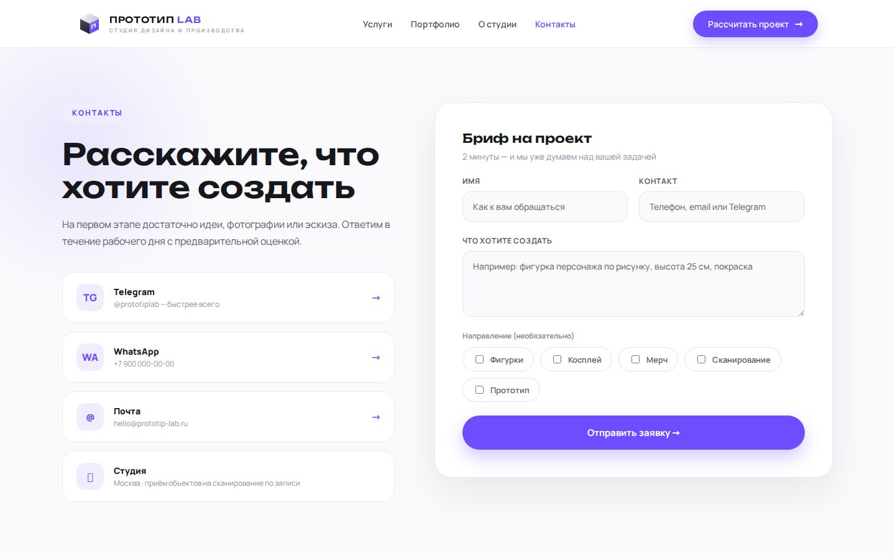 | 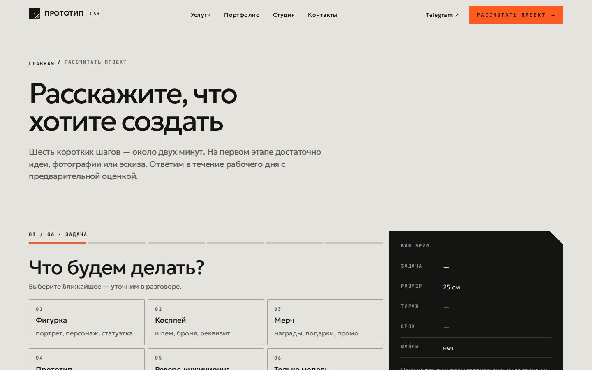 |
| 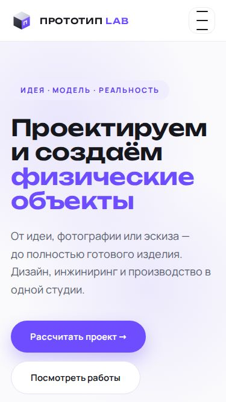 | 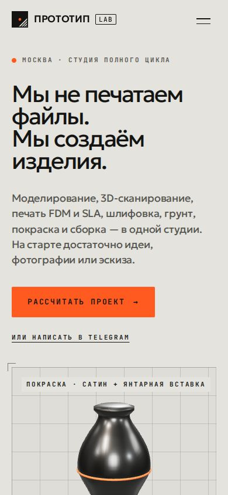 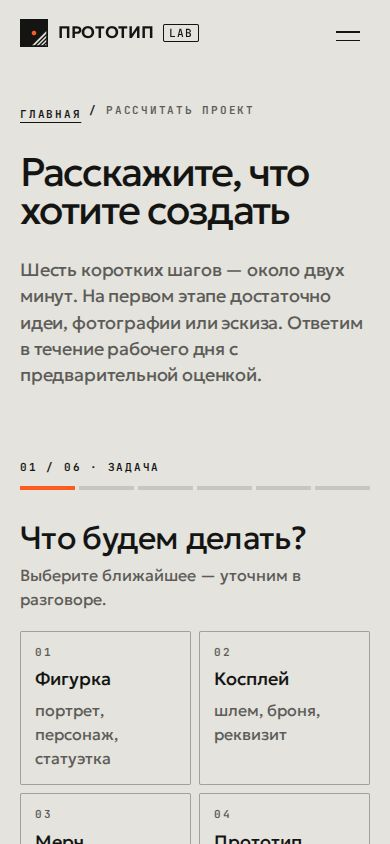 |

Процесс по прокрутке и сравнение технологий:

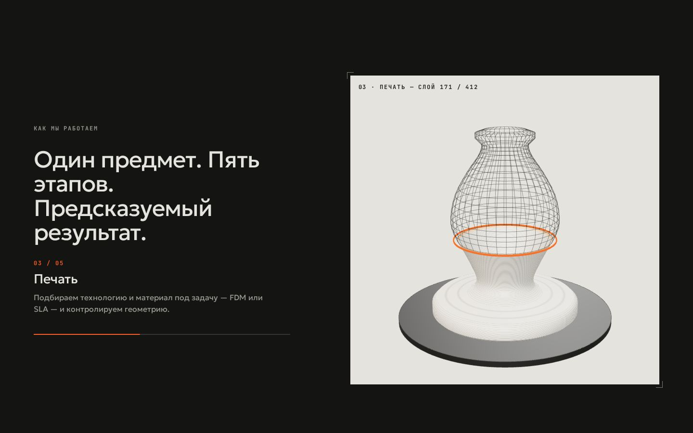
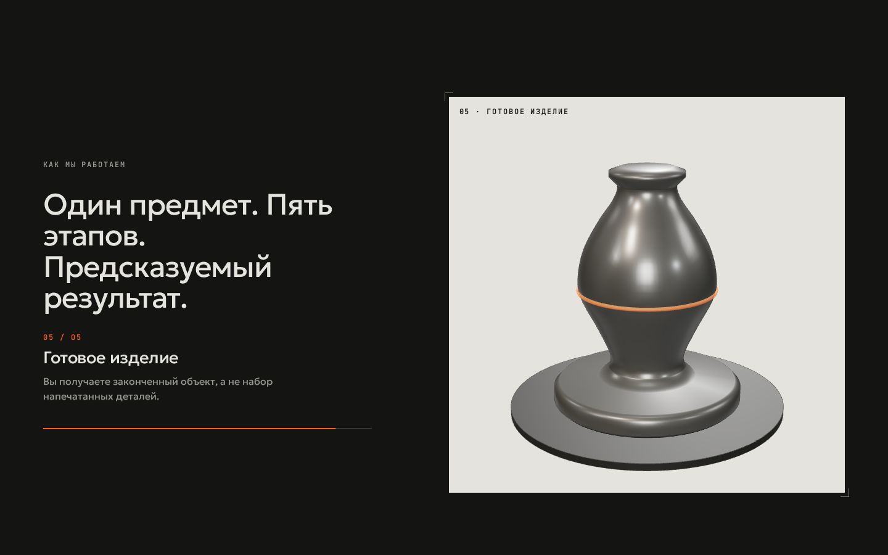
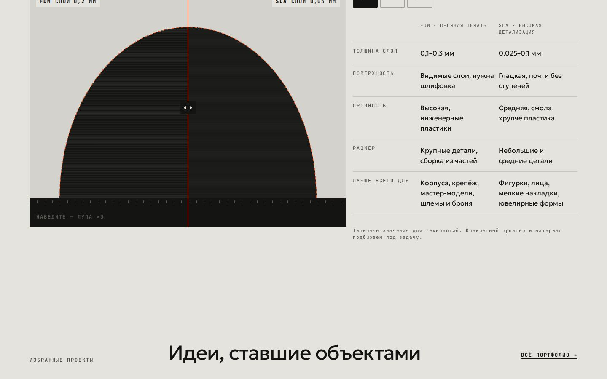
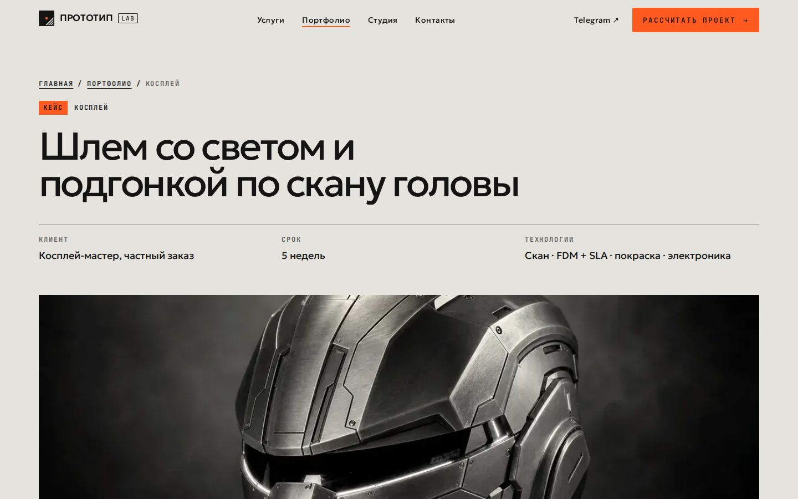

## Нужно подтвердить у владельца

Полный список с тем, что сделано на сайте: [`needs-confirmation.md`](clone-workspace/prototiplab/needs-confirmation.md).
Коротко: реальные фото работ (все текущие — рендеры); номер WhatsApp (был заглушкой, убран); рабочая почта
(домен с дефисом ≠ домену сайта, скрыта); цифры «1000+ проектов», «5+ лет», «50 мкм» (убраны); отзывы (убраны,
в одном было 200 наград против 120 в кейсе); цифры и публикуемость кейсов; разрешение на шлем, похожий на персонажа
франшизы; адрес и часы; **реквизиты оператора персональных данных — без них политику конфиденциальности публиковать
нельзя** (в тексте стоят плейсхолдеры); куда отправлять заявки; номер Метрики; список оборудования.

## Проверки

Нужен запущенный `npm run preview` в соседнем терминале и браузер Playwright (`npx playwright install chromium`).

```bash
npm run qa             # гейт стилей + интерактив + запрещённые приёмы
npm run qa:lighthouse  # CHROME_PATH=… Lighthouse mobile и desktop
```

| Проверка | Результат |
|---|---|
| Гейт `assert-styles.mjs` (90 утверждений из DESIGN.md, 1440 и 390 px, фокус) | **90/90, 0 ошибок**; цикл 1: 85/87 (два неоднозначных селектора), цикл 2 и 3: 90/90 — [`final-report.md`](clone-workspace/prototiplab/final-report.md) |
| Сборка | `astro build`, 17 страниц, exit 0 |
| Интерактив (`scripts/e2e.mjs`) | 36/36 |
| Запрещённые приёмы (`banned.md`, исходники + вычисленные стили 17 страниц) | 0 нарушений |

Lighthouse 13, локально (`dist` через `astro preview`), 27.09.2026:

| Маршрут | Устройство | Perf | A11y | Best pr. | SEO | LCP | TBT | CLS |
|---|---|---|---|---|---|---|---|---|
| / | mobile | 93 | 100 | 100 | 100 | 2.6 s | 0 ms | 0.055 |
| / | desktop | 100 | 100 | 100 | 100 | 0.5 s | 0 ms | 0.015 |
| /raschet/ | mobile | 97 | 100 | 100 | 100 | 2.1 s | 0 ms | 0.007 |
| /raschet/ | desktop | 100 | 100 | 100 | 100 | 0.5 s | 0 ms | 0.001 |
| /uslugi/skanirovanie/ | mobile | 96 | 100 | 100 | 100 | 2.1 s | 0 ms | 0.066 |
| /uslugi/skanirovanie/ | desktop | 100 | 100 | 100 | 100 | 0.5 s | 0 ms | 0.001 |
| /portfolio/ | mobile | 98 | 100 | 100 | 100 | 2.4 s | 0 ms | 0 |
| /portfolio/ | desktop | 100 | 100 | 100 | 100 | 0.3 s | 0 ms | 0.012 |

Lighthouse работает в headless Chrome с программным WebGL, поэтому мерит статичную версию первого экрана —
ту же, что получат слабые устройства. На устройстве с аппаратным WebGL three.js (136 КБ gzip) и GSAP (27 КБ gzip) подгружаются отдельным чанком только когда первый экран в зоне видимости и проверка возможностей пройдена.
Не проверено: Safari/WebKit (не запускается на машине сборки) и реальные данные CrUX до выкладки.

## Структура

```
src/data/          site.ts (контакты, процесс, технологии), services.ts, cases.ts — весь контент
src/components/    Header, Footer, Hero, ProcessScroll, Compare, QuoteForm, ServicesIndex, CaseCard, ObjectSvg…
src/scripts/       main.ts (появления, шапка, меню, Lenis), hero/process/compare/portfolio/quote.ts, object/ (three.js)
src/styles/        tokens.css (токены DESIGN.md), global.css
clone-workspace/   аудит, бренд, референс, план интерактива, DESIGN.md + assertions.json, QA, Lighthouse
scripts/           регрейд фото, редиректы, OG, гейт, e2e, запрещённые приёмы, Lighthouse, скриншоты
legacy/            прежний сайт как был
```

Методология: [per-simmons/clone-app-pat-pro-public](https://github.com/per-simmons/clone-app-pat-pro-public) —
контракт, стадии и гейт `assert-styles.mjs` (скопирован без изменений); вместо расширения Chrome — Playwright,
гейт проверяет новую дизайн-спецификацию, а не референс.
